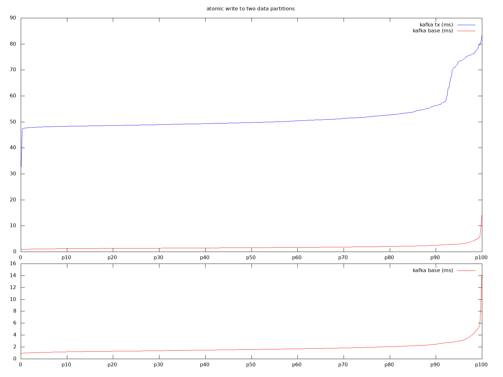
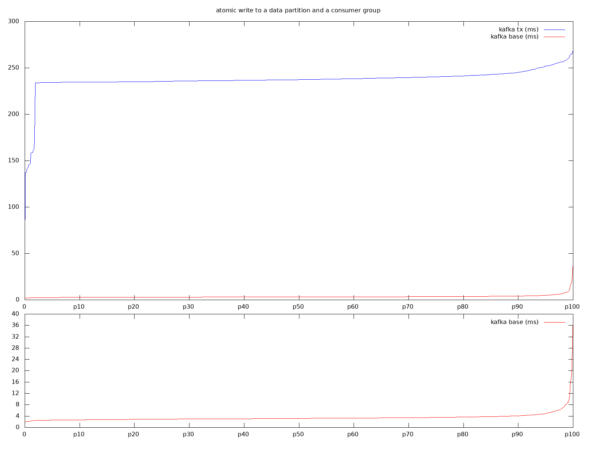

# Kafka transactional performance

In a nutshell we compare multi-partition write (`BaseWritesBench`) with atomic multi-partition write (`TxWritesBench`) and naive streaming with transactional streaming (`TxStreamingBench`).

## Results
 
Transactional writes have 30x-50x overhead compared to baseline.
 

 
Transactional streaming processing has 40x-120x overhead compared to baseline.
 


### What do the tests do?
 
`BaseWritesBench` sends two messages to two topics asynchronously (one to each topic, using `KafkaProducer.send`) and then waits until the returned futures resolve. It does it in a loop and records how long each iteration took.
 
`BaseStreamingBench` fills a source topic, reads the source topic in batches then for each record in a batch it sends a message to a target topic (`KafkaProducer.send`), sends an offset to a consumer group (`KafkaConsumer.commitSync`) and waits until the returned future resolves. The test measures only the write path (`send` and `commitSync`) and doesn't include the fetch part.
 
`TxWritesBench` is similar to `BaseWritesBench` with an exception it wraps each iteration in a transaction: the test starts a transaction, sends two messages to two topics asynchronous (one to each topic, using `KafkaProducer.send`), commits the transaction and waits until the returned futures resolve.
 
`TxStreamingBench` is similar to `BaseStreamingBench`: fills a source topic, reads the source topic in batches then for each record in a batch it starts a transactions, sends a message to a target topic (`KafkaProducer.send`), sends an offset to a consumer group (`KafkaProducer.sendOffsetsToTransaction`) and waits until the returned future resolves. The test measures only the write path (`send` and `sendOffsetsToTransaction`) and doesn't include the fetch part.
 
### Coordinated omission?
 
Usually performance tests compensate for the coordinated omission. But we don't do it here because we measure different things. Avoiding coordinated omission matters when we want to answer to a question how a system behaves with a given load (on average a system has X tps). While we want to measure the theoretical limitations of the transaction protocol (a system can't do better than Y tps) so we execute transactions in isolation, one after another over and over again.

## How to reproduce

Spawn a 3-nodes (i3.large, same AZ) Kafka (2.7) cluster backed by NVMe (/dev/nvme0n1) drive using XFS file system. With settings based on settings/zoo.cfg and settings/kafka.properties
 
(don't forget to open the intra-cluster ports: 2888, 8888, 33145, 3888, 9092)
 
Spawn a control node with JDK, Maven, Kafka (with environment variable KAFKA pointed to it).
 
Clone this repo & build the tests on the control node:
 
```bash
git clone
cd kafka-tx-performance
pushd tests
mvn clean dependency:copy-dependencies package
popd
```
 
Create the target topics:
 
```bash
$KAFKA/bin/kafka-topics.sh --create --topic topic1 --partitions 1 --replication-factor 3 --bootstrap-server NODE1_IP:9092
$KAFKA/bin/kafka-topics.sh --create --topic topic2 --partitions 1 --replication-factor 3 --bootstrap-server NODE1_IP:9092
```
 
Run the experiments (before each experiment kill the kafka and zookeeper processes, wipe the data directory, restart the processes and recreate the topics):
 
```bash
KAFKA_CONNECTION=NODE1_IP:9092 WARMUP=1000 TXES=1000 MEASURES=kafka.base.writes.log java -cp $(pwd)/tests/target/performance-1.0-SNAPSHOT.jar:$(pwd)/tests/target/dependency/* io.vectorized.tests.BaseWritesBench
 
KAFKA_CONNECTION=NODE1_IP:9092 WARMUP=1000 TXES=1000 MEASURES=kafka.base.streaming.log java -cp $(pwd)/tests/target/performance-1.0-SNAPSHOT.jar:$(pwd)/tests/target/dependency/* io.vectorized.tests.BaseStreamingBench
 
KAFKA_CONNECTION=NODE1_IP:9092 WARMUP=1000 TXES=1000 MEASURES=kafka.tx.writes.log java -cp $(pwd)/tests/target/performance-1.0-SNAPSHOT.jar:$(pwd)/tests/target/dependency/* io.vectorized.tests.TxWritesBench
 
KAFKA_CONNECTION=NODE1_IP:9092 WARMUP=1000 TXES=1000 MEASURES=kafka.tx.streaming.log java -cp $(pwd)/tests/target/performance-1.0-SNAPSHOT.jar:$(pwd)/tests/target/dependency/* io.vectorized.tests.TxStreamingBench
```
